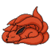

# Kurama 🦊

A macOS desktop pet based on the legendary **Nine-Tailed Fox (Kurama)** from Naruto — lives on your screen, chases your cursor, and roams across all your monitors and Mission Control Spaces.

Forked from [crgimenes/neko](https://github.com/crgimenes/neko) and rebuilt with custom Kurama pixel art sprites and macOS multi-Space support.

---

<p align="center">
  
  &nbsp;&nbsp;&nbsp;&nbsp;
  
  &nbsp;&nbsp;&nbsp;&nbsp;
  
</p>

---

## Features

- **Follows your cursor** across your entire screen
- **Multi-monitor support** — roams across all connected displays
- **All Spaces** — stays visible on top of full-screen apps and Mission Control Spaces using CoreGraphics + AppKit
- **Idle animations** — scratch, wash, yawn, and fall asleep when you stop moving
- **Transparent floating window** — no title bar, no dock icon, just the fox
- **Click to pause** — left-click to freeze Kurama, click again to resume
- **Configurable** via environment variables or `kurama.ini`

---

## Animations

| State | Trigger |
|-------|---------|
| 🏃 Walking (8 directions) | Cursor is far away |
| 👀 Awake | Cursor is nearby |
| 🐾 Scratch | Idle for a few seconds |
| 🧼 Wash | Idle a bit longer |
| 😮 Yawn | Getting sleepy |
| 💤 Sleep | Cursor has been still for a while |

---

## Requirements

- macOS 12+ (Apple Silicon or Intel)
- Go 1.21+

---

## Build & Run

```bash
git clone https://github.com/aivsomkar/Kurama.git
cd Kurama
go build -o kurama ./...
./kurama
```

### macOS permissions

On first run macOS may prompt for **Accessibility** access so Kurama can track the cursor globally across Spaces. Grant it in:

> System Settings → Privacy & Security → Accessibility → add your Terminal

---

## Configuration

Kurama reads from environment variables (prefixed `KURAMA_`) or a `kurama.ini` file in the working directory.

| Variable | Default | Description |
|----------|---------|-------------|
| `KURAMA_SPEED` | `10.0` | Movement speed (pixels per tick at 50 TPS) |
| `KURAMA_SCALE` | `1.0` | Sprite scale multiplier |
| `KURAMA_QUIET` | `false` | Disable all sound effects |
| `KURAMA_MOUSEPASSTHROUGH` | `false` | Let clicks pass through the fox window |

**Examples:**

```bash
# Faster and bigger
KURAMA_SPEED=18 KURAMA_SCALE=1.5 ./kurama

# Silent mode
KURAMA_QUIET=true ./kurama
```

**`kurama.ini`:**
```ini
speed=12
scale=1.2
quiet=false
mousepassthrough=false
```

---

## Custom Sprites

All sprites are 64×64 PNG files with transparent backgrounds, embedded into the binary at compile time. To use your own art, replace files in `assets/` and rebuild.

| Files | Animation |
|-------|-----------|
| `awake.png` | Idle sitting |
| `up1/2`, `down1/2`, `left1/2`, `right1/2` | Cardinal directions |
| `upleft1/2`, `upright1/2`, `downleft1/2`, `downright1/2` | Diagonal directions |
| `scratch1/2` | Scratching |
| `wash1/2` | Grooming |
| `yawn1/2` | Yawning |
| `sleep1/2` | Sleeping |

---

## How It Works

Kurama uses [Ebitengine](https://ebitengine.org/) for the game loop and rendering. The window runs with:

- `ScreenTransparent: true` — only the sprite pixels are visible
- `WindowDecorated: false` — no title bar or frame
- `WindowFloating: true` — stays above normal windows

For macOS Spaces and full-screen app support, a native Objective-C helper (via CGo) sets `NSWindowCollectionBehaviorCanJoinAllSpaces | FullScreenAuxiliary` and raises the window to `NSScreenSaverWindowLevel` using an `NSTimer` that refreshes every 2 seconds.

Cursor tracking uses `CGEventCreate` from CoreGraphics to read the global cursor position, enabling the fox to follow the cursor across monitors and Spaces.

---

## Credits

- Original `neko` concept and codebase — [crgimenes/neko](https://github.com/crgimenes/neko)
- Game engine — [Ebitengine](https://ebitengine.org/) by Hajime Hoshi
- Kurama pixel art sprites — AI-generated and customised
- Inspired by the original [oneko](http://www.daidouji.com/oneko/) (1989)

---

## License

MIT — see [LICENSE](LICENSE)
